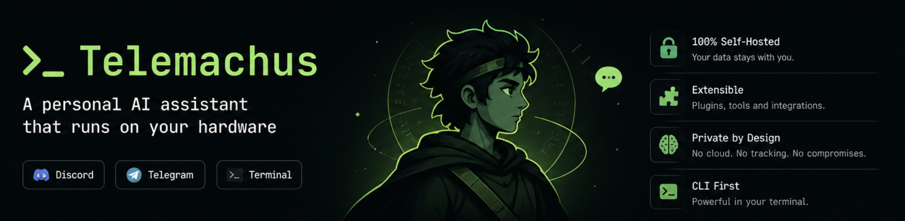

<p align="center">
  
</p>

<p align="center">
  <a href="https://github.com/Kristos/telemachus/actions/workflows/ci.yml"></a>
  <a href="https://opensource.org/licenses/MIT"></a>
  <a href="https://github.com/Kristos/telemachus/releases"></a>
  <a href="https://github.com/Kristos/telemachus/pkgs/container/telemachus"></a>
  <a href="https://bun.sh"></a>
</p>

---

## What it is

Telemachus is **personal AI infrastructure**, not a chatbot. It's the layer that ties the hardware you already own into one agent: a homelab Mac running Docker 24/7, a GPU box for local llama.cpp, your daily laptop, and your phone for tap-in via Discord or Telegram. Same agent core everywhere, same tools, same session store.

Built because I went looking for one tool that could (a) run as a Discord bot, a Telegram bot, a terminal UI, **and** headless background jobs from one binary, (b) treat local llama.cpp as a first-class peer to Anthropic and OpenAI-compatible APIs, (c) speak MCP, and (d) get distributed across heterogeneous hardware. There's plenty in each individual niche; nothing that does all four.

<!-- Demo GIF — generated from docs/assets/demo.tape via `vhs docs/assets/demo.tape`.
     Will render once committed; safe to leave commented until recorded. -->
<!-- <p align="center"></p> -->

## What I actually run on it

- **Email automations** — drafted, scheduled, or triggered by events
- **RAG pipelines** — index refreshes and search results pinged to Discord/Telegram when they complete
- **Home setup monitoring** — services on the homelab Mac; alerts when something needs attention
- **Docker orchestration** — kick, monitor, and inspect long-running containers from the bot
- **Self-built apps** — e.g. a personal finance / investment tracker; its jobs and ad-hoc queries fire and reply through the bots
- **Data pipelines** — the small kind you don't want to spin up Airflow for
- **Git ops from anywhere** — push, pull, run a script, kick a deployment from my phone over Discord or Telegram
- **Coding from the terminal** — TUI agent for daily work

The 4-class router silently picks frontier cloud / cheap cloud / local llama.cpp per turn. Manual `/model` overrides feed back as dissatisfaction signals so future routing improves.

## Front-ends, one core

| Front-end | What it's good for |
|-----------|---------------------|
| **Discord bot** | Tap-in from anywhere; long-running conversations; `!run` / `!status` / `!orchestrate` commands |
| **Telegram bot** | Same as Discord, just different vibes |
| **Terminal UI** | Daily coding work; live status bar; slash commands; session resume |
| **Headless agent-runner** (`tm agent run <name>`) | Cron jobs, webhooks, anything that fires without a human |
| **Multi-agent orchestrator** (`tm orchestrate`) | Worker/reviewer loop with parallel fan-out and blast-radius gate, for tasks worth coordinating |

---

## Quick Start

Get the Discord bot running in under 30 minutes — using the **pre-built image** so you don't need to build anything:

1. **Set environment variables** in a fresh `.env` file:
   ```bash
   curl -fsSL https://raw.githubusercontent.com/Kristos/telemachus/main/.env.example -o .env
   curl -fsSL https://raw.githubusercontent.com/Kristos/telemachus/main/docker-compose.yml -o docker-compose.yml
   # Edit .env — fill in ANTHROPIC_API_KEY, DISCORD_BOT_TOKEN, DISCORD_OWNER_ID
   ```

2. **Pull the image and start:**
   ```bash
   docker compose up discord
   ```

3. **DM your bot on Discord** — it should reply within a few seconds.

> Telegram: same flow — set `TELEGRAM_BOT_TOKEN` + `TELEGRAM_OWNER_CHAT_ID` in `.env`, then `docker compose up telegram`.

The image lives at [`ghcr.io/kristos/telemachus`](https://github.com/Kristos/telemachus/pkgs/container/telemachus). Pin to a tag (`v4.0.0`) for stability or use `latest` to track `main`.

### Build from source instead

```bash
git clone https://github.com/Kristos/telemachus.git
cd telemachus
cp .env.example .env  # then edit
docker compose up --build discord
```

### One-click deploy

Telemachus is a long-running stateful bot, so most one-click PaaS deploy buttons aren't a great fit (they're optimised for stateless web apps). Instead, point any container host at the published image:

| Host | Notes |
|------|-------|
| **[Railway](https://railway.app/new/template)** | New project → "Deploy from Docker image" → `ghcr.io/kristos/telemachus:latest` → set the env vars from `.env.example` |
| **[Fly.io](https://fly.io/docs/launch/deploy/)** | `fly launch --image ghcr.io/kristos/telemachus:latest`, then `fly secrets set ANTHROPIC_API_KEY=… DISCORD_BOT_TOKEN=… DISCORD_OWNER_ID=…` |
| **Self-hosted Docker** | `docker compose up -d` and a reverse proxy if you expose the auto-update webhook |
| **Native (macOS)** | `tm discord install` writes a launchd plist — see [docs/keychain.md](docs/keychain.md) |

---

## Providers

Telemachus supports four provider modes:

| Provider | Config key | Env var to set | Base URL |
|----------|------------|----------------|----------|
| Anthropic (Claude) | `anthropic` | `ANTHROPIC_API_KEY` | default (api.anthropic.com) |
| OpenAI | `openai-compat` | `OPENAI_API_KEY` | `https://api.openai.com/v1` |
| Z.ai | `openai-compat` | `OPENAI_API_KEY` *(use your Z.ai key)* | `https://api.z.ai/api/paas/v4` |
| OpenRouter | `openai-compat` | `OPENAI_API_KEY` *(use your OpenRouter key)* | `https://openrouter.ai/api/v1` |
| llama.cpp (local) | `llamacpp` | _(none)_ | `http://localhost:8080/v1` |

> The `OPENAI_API_KEY` env var is just the variable name Telemachus reads for any OpenAI-compatible provider — put **whichever provider's key you're actually using** in it (your Z.ai key for Z.ai, OpenRouter key for OpenRouter, etc.). You only need a real OpenAI key if you're using OpenAI itself.

To switch providers, set `provider` and `model` in `~/.telemachus/config.json` and ensure the corresponding env var is present in `.env`. For OpenAI-compatible providers, also set `providerConfigs.openai-compat.baseURL` to the correct endpoint. A `fallbackProvider` field lets you configure automatic failover if the primary provider errors.

---

## Discord Bot Setup

1. Visit [discord.com/developers/applications](https://discord.com/developers/applications) and click **New Application**.
2. Go to the **Bot** tab. Under **Privileged Gateway Intents**, enable **Message Content Intent** (the only privileged intent the bot needs). Leave Presence Intent and Server Members Intent **off** — Telemachus doesn't use either.
3. Copy the bot token → set `DISCORD_BOT_TOKEN` in `.env`.
4. Find your Discord user ID: Settings → Advanced → enable **Developer Mode**, then right-click your username anywhere → **Copy User ID**. Set `DISCORD_OWNER_ID` in `.env`.
5. Generate an invite URL: **OAuth2 → URL Generator** → scopes: `bot` → permissions: Send Messages, Read Message History, Create Public Threads, Send Messages in Threads. Open the generated URL and invite the bot to your server.
6. `docker compose up discord` — DM the bot to start a session.

> Telemachus uses the regular `Guilds`, `GuildMessages`, `DirectMessages` intents at the gateway layer. Those are not toggleable in the Developer Portal — they're enabled in code. Only `MessageContent` requires the portal toggle.

> **Note:** Leave `allowedUsers: []` in `config.json`. The bot reads `DISCORD_OWNER_ID` from the environment automatically when the array is empty — no hardcoding required.

---

## Telegram Bot Setup

1. Open Telegram and message **@BotFather**. Send `/newbot` and follow the prompts to name your bot.
2. Copy the bot token BotFather gives you → set `TELEGRAM_BOT_TOKEN` in `.env`.
3. Find your Telegram chat ID:
   - Start a DM with your new bot (send `/start`).
   - In a browser, visit: `https://api.telegram.org/bot<YOUR_TOKEN>/getUpdates`
   - Look for `"chat":{"id":<NUMBER>}` in the response — that number is your chat ID.
4. Set `TELEGRAM_OWNER_CHAT_ID` in `.env`.
5. `docker compose up telegram` — DM your bot to start.

---

## CLI Reference

Install the `tm` binary (requires Bun):

```bash
bun run build:compile   # produces ./tm at repo root
```

Or run directly without compiling:

```bash
bun run src/index.ts
```

### Subcommands

**Interactive TUI**

```
tm                          Start an interactive TUI session (no subcommand)
tm --resume / -r            Resume the last session
tm --session <id> / -s      Resume a specific session by ID
```

**Bot services**

```
tm discord                  Run Discord bot (foreground)
tm discord install          Install as a launchd service (macOS)
tm discord uninstall        Remove the launchd service
tm discord usage            Show token usage summary

tm telegram                 Run Telegram bot (foreground)
tm telegram install         Install as a launchd service (macOS)
tm telegram uninstall       Remove the launchd service
```

**Agent jobs**

```
tm agent run <name>         Run a configured agent job by name
tm agent status             Show status of all agent jobs
tm agent install <name>     Install agent job as a launchd service (macOS)
tm agent uninstall <name>   Remove agent job launchd service
tm agent list               List all configured agent jobs
```

**Project index**

```
tm index                    Index the current project (SQLite symbol/file index)
tm index watch              Watch for changes and keep index up to date
tm index status             Show index stats (file count, last scan, HEAD SHA)
tm index serve              Expose the index as an MCP server (stdio transport)
```

**Orchestration**

```
tm orchestrate <config.json>          Run a multi-agent orchestration from config
tm orchestrate --template <name>      Use a built-in template
tm orchestrate --prompt "<text>"      Decompose a prompt into tasks and run
```

**Global flags**

```
--profile <name>            Switch active profile (defined in config.json)
--mode yolo|ask|readonly    Permission mode (yolo = no confirmations)
--help                      Show help
--version                   Show version
```

> **Interactive mode is bare `tm`** — there is no `tm chat` subcommand.

---

## Three-Machine Reference Setup

One common topology is to spread roles across machines:

| Machine | Role | What runs |
|---------|------|-----------|
| Workstation | Daily driver | `tm` (interactive TUI) |
| Always-on server | Bots + jobs | `docker compose up -d discord telegram` |
| GPU rig | Local inference | llama.cpp server (Tailscale URL in config) |

You can also run all three roles on a single machine — the Docker services and `tm` TUI are fully independent.

---

## Architecture

Telemachus has three layers:

**Transport** — Discord bot (gateway), Telegram bot (polling), or interactive TUI (Ink/React). Each transport creates a session and sends messages into the agent core.

**Agent core** — The agent loop handles tool dispatch, MCP client connections, `/compact` summarization, session persistence (JSONL), and permission gating across five modes: `yolo` (no prompts), `ask` (confirm before bash / file writes), `readonly` (silent deny on writes), `plan` (research-only, no side effects), and `agent` (relaxed for headless agent-runner jobs). A `RouterProvider` routes by intent (4-class classifier — code / research / orchestration / casual); a `FallbackProvider` retries with a backup provider on 401/429/5xx.

**Providers** — Anthropic (native SDK, prompt caching), OpenAI-compatible (OpenAI, Z.ai, OpenRouter, any OpenAI-spec endpoint), and llama.cpp (local GGUF inference). All implement the same `Provider` interface — see `src/providers/types.ts`.

For deep-dives see `docs/src/content/docs/guides/`:
- `llama-cpp.md` — running local inference
- `agent-jobs.md` — scheduled headless agent jobs
- `mcp-servers.md` — connecting MCP tool servers
- `orchestration.md` — multi-agent task orchestration

---

## Sandboxing

**macOS host (bare `tm`, no Docker):** bash tool calls are wrapped with `sandbox-exec` for filesystem isolation. The sandbox profile restricts writes to the project directory and a small set of system paths.

**Docker (Linux container):** `sandbox-exec` is a macOS-only tool and does not exist on Linux. When running inside the Docker image, the container itself provides the isolation boundary. Linux seccomp support is planned for a future release.

Currently macOS host and Docker (Linux) are the only tested execution paths.

---

## License

MIT — see [LICENSE](LICENSE).

---

## Contributing

See [CONTRIBUTING.md](CONTRIBUTING.md).
